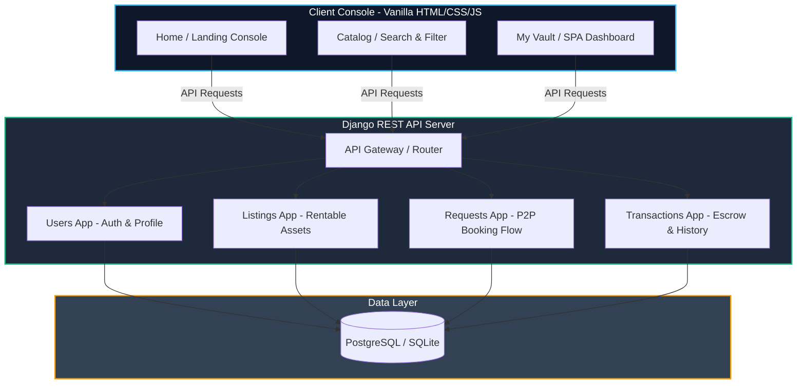

# 📦 BorrowBox

> **Borrow anything, anytime. The secure, trustless peer-to-peer rental network designed exclusively for university campuses.**

[](https://github.com/)
[](https://www.djangoproject.com/)
[](https://www.django-rest-framework.org/)
[](https://www.postgresql.org/)
[](LICENSE)

---

## 📖 Overview

**BorrowBox** is a localized, student-centric circular economy platform. It allows verified students to securely lend and borrow high-value items—such as laptops, cameras, textbooks, calculators, instruments, and dorm appliances—directly from their peers on campus. 

By utilizing institutional email verification (`.edu`), a robust mutual rating system, and deposit-secure workflows, BorrowBox eliminates the need for students to buy expensive equipment they only need temporarily, reducing electronic and textbook waste while enabling lenders to earn passive income.

---

## 🏗️ Architecture & System Design

BorrowBox is architected as a decoupled web application containing a responsive, modern frontend client and a modular Django REST API backend.



---

## ✨ Features

### 🖥️ Client Frontend
*   **Dynamic Landing Console**: Modern glassmorphic layout featuring a live network statistics counter, interactive verification timeline, and a quick-access category catalog.
*   **Rich Catalog Console**: Advanced item lookup featuring search indexing, real-time category filtering (Electronics, Study, Photography, Sports, Instruments), instant price-range calculations, and availability check-boxing.
*   **The Vault (SPA Dashboard)**: An immersive single-page application dashboard featuring:
    *   **Dashboard Home**: Personal statistics dashboard with greeting and quick insights.
    *   **My Listings Management**: Manage active listings, inspect outstanding requests, and upload assets.
    *   **Borrow Requests**: View, approve, or reject pending rental requests from campus peers.
    *   **Active Borrowings**: Live countdown meters showing days remaining on active rentals and deposit statuses.
    *   **Transaction History**: Auditable ledger tracking historical rentals, earnings, and expenses.
    *   **Notifications Hub**: Real-time alerts for approved bookings, return requests, and system updates.
    *   **Profile Settings**: Editable credentials and visual theme toggling (seamless system-wide **Dark/Light Mode** support).

### ⚙️ REST API Backend
*   **`users`**: Manages custom user profiles, institutional verification (`.edu` checking), ratings, and secure sessions.
*   **`listings`**: Handles the publication, updates, search, sorting, and indexing of active campus assets.
*   **`requests_app`**: Implements state-machine booking processes (Pending, Accepted, Rejected, Cancelled).
*   **`transactions`**: Orchestrates rental history, deposit holding, and security escrow logs.

---

## 🛠️ Tech Stack

*   **Frontend**: 
    *   HTML5 (Semantic layouts)
    *   Vanilla CSS3 (Responsive grid-matrix, HSL design tokens, Glassmorphism, CSS Variables)
    *   Vanilla ES6+ JavaScript (Asynchronous state management, intersection observers, number counters)
    *   Iconography via FontAwesome 6.4.0
    *   Google Fonts: Inter
*   **Backend**: 
    *   Django 6.0.6+ & Django REST Framework (DRF) 3.17.1+
    *   Python-Decouple (Environment isolation)
    *   Django-CORS-Headers (Secure cross-origin resource sharing configuration)
*   **Database**: 
    *   PostgreSQL (Neon Serverless Integration for production)
    *   SQLite3 (For lightweight local testing & rapid prototyping)

---

## 📂 Repository Structure

```
BorrowBox/
├── client/                     # Frontend Static Web Interface
│   ├── templates/              # HTML documents (index, products, dashboard, login)
│   └── static/
│       ├── css/                # Styling stylesheets (root tokens, styles, views)
│       ├── js/                 # Client side functionality & API clients
│       └── images/             # Visual asset placeholders & branding graphics
├── backend/                    # Django REST API Backend
│   ├── config/                 # Primary Django project configurations & urls
│   ├── users/                  # User accounts, auth & verification handlers
│   ├── listings/               # Asset catalog, listing models & viewsets
│   ├── requests_app/           # Peer-to-peer booking workflows & validation
│   ├── transactions/           # Transaction logging, escrow details, & history
│   ├── manage.py               # Django utility script
│   └── requirements.txt        # Python dependency manifest
├── NEXT_STEP.txt               # Developer migration notes
└── README.md                   # Project documentation (You are here)
```

---

## 🚀 Setup & Local Installation

### 1. Prerequisite Environments
Make sure you have the following installed on your machine:
*   [Python 3.10+](https://www.python.org/downloads/)
*   [Git](https://git-scm.com/)

---

### 2. Backend API Setup

1.  Navigate into the backend directory:
    ```bash
    cd backend
    ```

2.  Create and activate a virtual environment:
    ```bash
    # On Windows (CMD / PowerShell):
    python -m venv venv
    .\venv\Scripts\activate

    # On macOS / Linux:
    python3 -m venv venv
    source venv/bin/activate
    ```

3.  Install the dependencies:
    ```bash
    pip install -r requirements.txt
    ```

4.  Set up environment configurations:
    Create a `.env` file in the root of the `backend/` directory by copying the fields:
    ```ini
    SECRET_KEY=your_django_secret_key_here
    DB_NAME=neondb
    DB_USER=your_postgres_username
    DB_PASSWORD=your_postgres_password
    DB_HOST=your_neon_or_postgres_host_address
    DB_PORT=5432
    ```

5.  Integrate the `.env` database in `backend/config/settings.py`:
    Modify the `DATABASES` section to parse decoupled credentials:
    ```python
    from decouple import config

    DATABASES = {
        'default': {
            'ENGINE': 'django.db.backends.postgresql',
            'NAME': config('DB_NAME'),
            'USER': config('DB_USER'),
            'PASSWORD': config('DB_PASSWORD'),
            'HOST': config('DB_HOST'),
            'PORT': config('DB_PORT', cast=int),
        }
    }
    ```

6.  Execute Database Migrations:
    ```bash
    python manage.py makemigrations
    python manage.py migrate
    ```

7.  Run the API Server:
    ```bash
    python manage.py runserver
    ```
    The Django server will spin up on `http://127.0.0.1:8000/`.

---

### 3. Frontend Web Setup

The client-side interface contains lightweight static files.

*   To run the frontend client, launch a development server or double-click `client/templates/index.html` to open it in your browser.
*   **Recommended (VS Code Users)**: Install the **Live Server** extension, right-click `client/templates/index.html`, and select **Open with Live Server** to support real-time previewing and responsive CORS tests.

---

## 🔒 Security & Campus Trust Protocol

Safety is the cornerstone of the BorrowBox ecosystem:
1.  **Strict Institutional Filtering**: Registration is gated by mandatory institutional domain filters (e.g., `user@university.edu`).
2.  **Verified Handover Protocol**: Handovers are designed to occur at pre-determined campus zones (such as campus security desks or library lobbies).
3.  **Deposit Holding**: High-value items require security deposits. Funds are held in a virtual escrow ledger until the items are marked returned and verified.
4.  **Mutual Rating Protocol**: Double-sided accountability scores reward honest borrowers and lenders, systematically weeding out bad actors.

---

## 🗺️ Roadmap
- [ ] Connect Frontend SPA calls to backend endpoints (`fetch()` endpoints replacing mockup DB arrays).
- [ ] Add real-time chat with WebSockets (channels) for borrower-lender negotiation.
- [ ] Implement integrated map pinpoints for designated safe campus meetups.
- [ ] Incorporate third-party payment gateways (Razorpay, Stripe) for secure online deposit management.
- [ ] Set up automated email notification alerts.

---

## 📄 License
This project is licensed under the MIT License - see the [LICENSE](LICENSE) file for details.
